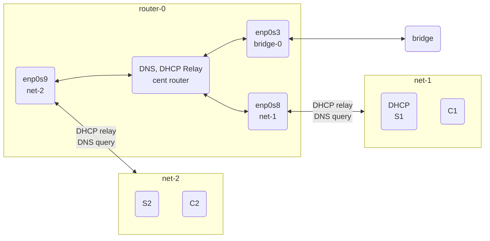

# Server-Setup-Pratice
36363-36465開源網路伺服器架設實務 

## Structure Diagram

## Service list
| Host | Service | Service name |
| -- |-- | -- |
| Router | DNS, DHCP Relay | `named`, `dhcrelay` |`
| S1 | DHCP | `dhcpd` |
| S2 | | |
| C1 | | |
| C2 | | |
