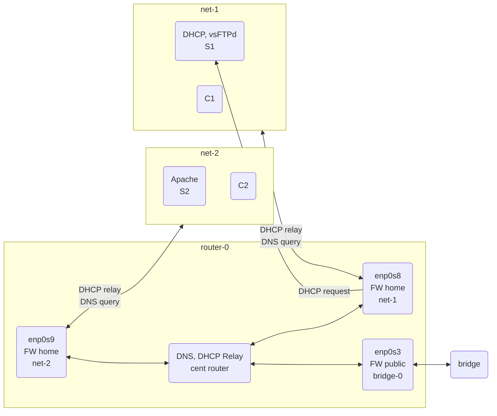

# Server-Setup-Practice
36363-36465開源網路伺服器架設實務 

## Architecture Diagram

## Service list
| Host | Service | Service name |
| -- |-- | -- |
| Router | Firewall, DNS, DHCP Relay | `firewalld`, `named`, `dhcrelay` |`
| S1 | DHCP vsFTPd | `dhcpd` `vsftpd` |
| S2 | Apache, PHP, MariaDB | `httpd`, `php-fpm`, `mariadb` |
| C1 | None (client) | |
| C2 | None (client) | |
